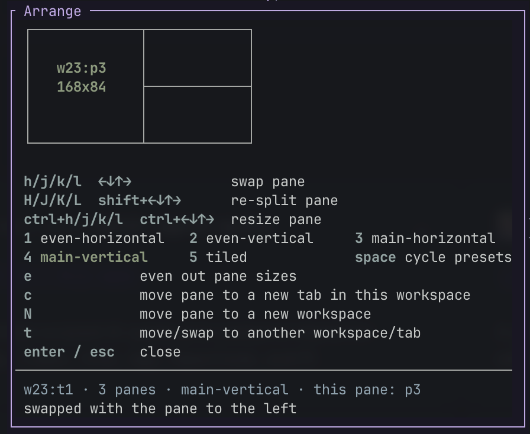
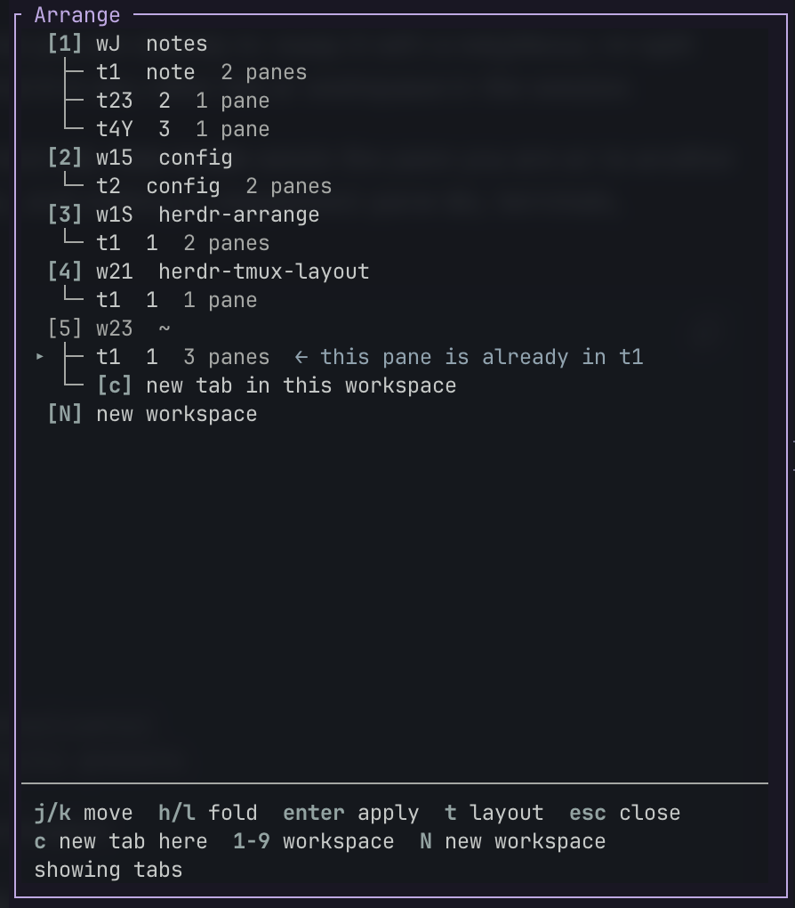

# herdr-arrange

A popup for rearranging [herdr](https://herdr.dev) panes, anchored on the pane you are
already in: swap it with a neighbour, re-split around it, resize it, lay the whole tab out
to a preset, or send it to any other tab or workspace in the session.

Two views. **Layout mode** rearranges the panes of the current tab; **tree mode** sends the
pane you are on to another tab or workspace. Everything moves live behind the popup, and
nothing is respawned: pane ids, terminals, scrollback and running agents all survive.



*Layout mode, on a three-pane tab: the map says the pane you are on is `w23:p3` at
168x84, and the highlighted preset is the one the tab already matches.*

## Install

Needs herdr 0.7.4+, macOS or Linux, and **Go 1.24.2 or newer on `PATH`** — the plugin is
one Go binary, built on your machine at install time rather than shipped.

```sh
herdr plugin install crierr/herdr-arrange
```

Then bind it. Plugins cannot register keys, so this part is yours; add it to
`~/.config/herdr/config.toml`:

```toml
[[keys.command]]
key = "prefix+m"
type = "plugin_action"
command = "herdr-arrange.open"
description = "arrange panes"

[[keys.command]]
key = "prefix+M"
type = "plugin_action"
command = "herdr-arrange.open-tree"
description = "move pane to…"
```

`herdr config check` will tell you if it disagrees. Both actions also show up in herdr's
own plugin action list, so you can try them before binding anything:

```sh
herdr plugin action invoke herdr-arrange.open
```

To work on the plugin instead of installing a release:

```sh
git clone git@github.com:crierr/herdr-arrange.git
cd herdr-arrange && go build -trimpath -o bin/arrange .
herdr plugin link "$PWD"
```

## Layout mode

Opens on the tab you are in, with the pane you are on as the one being arranged.

| key | what it does |
|---|---|
| `h` `j` `k` `l`, arrows | swap this pane with its neighbour that way |
| `H` `J` `K` `L`, shift+arrows | re-split: detach this pane and re-attach it along that edge |
| ctrl+`h` `j` `k` `l`, ctrl+arrows | move the boundary that way, growing or shrinking this pane |
| `1`–`5` | apply a layout preset, with **this** pane as the main one |
| `space` | apply the next preset after the one the tab already matches |
| `e` | even out the pane sizes, without changing the layout |
| `c` | move this pane to a new tab in this workspace |
| `N` | move this pane to a new workspace |
| `t` | switch to tree mode |
| `enter`, `esc`, `q` | close |

The map at the top is the tab as it is now, one box per pane, with the pane being arranged
named and measured inside its own. Its shape is the tab's: a wide tab draws wide. The
numbers are herdr's own, so what the map says a pane is is what it is.

The status line names the layout the tab currently matches — relative to the pane being
arranged, so it is always the one the matching number key would reproduce. `custom` means
no preset matches.

ctrl+`hjkl` resizes the way tmux's `resize-pane` does: **the boundary goes the way you
press**. So ctrl+`l` widens a pane that has something to its right and narrows one that has
something to its left — either way, the line you were pointing at is the line that moves.
The split herdr moves is the nearest one on that axis, and it stops at herdr's own ratio
limits, which the popup reports rather than pretending it moved.

`H/J/K/L` walk outwards. Pressing `H` on `[A | [P / B]]` gives `[A | [P | B]]`; pressing it
again gives `[P | [A | B]]`, and once the pane owns a whole tab edge, further presses that
way do nothing.

`e` is tmux's `select-layout -E`: it evens out the sizes and leaves the layout alone. Every
split is re-weighted so that the cells either side of it get the same room along that
split's own axis, where a child split the other way counts as one cell however many panes
are inside it:

```
[[a | b] |0.8 [c / d]]   -->   [[a | b] |0.67 [c / d]]

                         three columns of equal width; c and d still share the
                         last one, half its height each
```

Only ratios change, so nothing moves and nothing flickers, and pressing `e` on a tab whose
sizes are already even just says so. Drag a split around and `e` puts it back.

That is also why `e` is safe on `main-horizontal` and `main-vertical`: a main pane against a
stack is one cell either side, so `e` keeps the main pane's half of the tab rather than
shrinking it to `1/n`. The one preset it does nudge is `tiled` with a short last row —
`tiled` gives every pane an equal share of the *area*, while `e` gives the rows an equal
share of the *height*.

herdr clamps split ratios to `[0.1, 0.9]`, so a hand-built run of more than ten columns
cannot be evened out exactly: there `e` says it did so *as far as herdr's ratio limits
allow* rather than claiming an evenness it cannot deliver.

## Tree mode

`prefix+M` opens straight here, and so does `prefix+m` on a tab with only one pane — there
is no layout to arrange there, but the pane can still go somewhere.



*Tree mode at its default fold level — every workspace and tab in the session, with the
selected row saying what `enter` would do to it. The room below the tree is held for the
panes level, so `l` never resizes the popup.*

The popup is as tall as the session needs, so the whole tree is usually on screen at
once; past that — or on a short terminal — it scrolls.

`h`/`l` and left/right fold the tree through three levels: the workspaces alone, their
tabs, and the panes inside those. It opens on the tabs, which is the level you want for
"where can this pane go"; `l` from there reveals the panes, starting with the one you
came in on. The popup is sized for the deepest level whatever it is showing, so folding
is instant and never resizes anything.

Folding a row away moves the cursor to its parent but remembers the row itself, so
unfolding lands back on it rather than at the top of the tree.

Where the pane lives now is dimmed and marked `(current)` — the tab as well as the pane,
since the tree opens folded to the tabs, where the pane's own row is not on screen and one
dim row among tabs reads as just another row.

`j`/`k` and the arrows move; `g`/`G`, `home`/`end`, `pgup`/`pgdown` and `ctrl+f`/`b`/`d`/`u`
work too. `1`–`9` jump straight to a workspace's action, `c` and `N` to the two synthetic
rows at the bottom — all of them at any fold level. The selected row is drawn in bold and
says exactly what `enter` will do, next to the row it would do it to:

| selected row | `enter` | `s` |
|---|---|---|
| a workspace | move this pane to a new tab in that workspace, then arrange it there | — |
| a tab | move this pane into that tab, then arrange it there | trade places with its first pane |
| a pane | move this pane next to that one, then arrange it there | trade places with it |
| the pane you are moving | back to layout mode | — |

A pane arriving in a tab lands to the *right* of the pane it was sent to, since a terminal
has width to spare where half its height often will not hold a usable pane. Layout mode is
opened on the destination afterwards, so `H/J/K/L` or a preset can put it somewhere else.

A pane row means the same thing wherever it is — somewhere to *land* — including in the tab
you are already in, where the pane is lifted out of the split tree and put back beside the
one you picked.

`s` swaps with it instead of landing beside it: the two panes **trade places**, each taking
the other's slot at the other's size, and the popup closes. It works on any pane in the
session, and on a tab row it means the first pane in that tab — the one unfolding would show
you first.

Inside one tab that is a single `pane.swap`: instant, no flicker, which is why the selected
row advertises it where landing beside a neighbour has to rebuild the tab (see below).

Across tabs herdr will not swap at all — `pane.swap` rewrites one tab's split tree and
refuses anything else with `cross_tab` — so the exchange is built out of moves around a
**stand-in pane**:

```
                     this tab          the other tab
split off a stand-in [A | tmp]         [B]
send A beside B      [tmp]             [B | A]
bring B beside tmp   [tmp | B]         [A]
close tmp            [B]               [A]
```

A two-way split collapses onto whichever pane is left, so each pane inherits the other's
slot *and* the other's ratio exactly. The stand-in earns its keep in the awkward case too:
when A is the only pane in its tab, it is what holds that tab open while A is away — herdr
would otherwise close the tab as A left, leaving B nowhere to come back to. The cost is a
shell spawned and killed and five calls where a same-tab swap is one, so a cross-tab swap
blinks and a local one does not.

## Why a tab flashes past sometimes

herdr has no API for restructuring a tab's tree in place. `layout.apply` respawns panes,
which would kill whatever is running in them, and `pane.move` back into the same tab is
refused. What *is* safe is moving a pane between tabs: that keeps the pane id, the terminal
and the process.

So a re-split, a preset, or landing a pane beside another pane of the same tab — anything
that changes the tab's shape rather than just its ratios — is done by parking panes in a
scratch tab called `arrange:parking` and moving them back one at a time in the right order. herdr closes the scratch tab when its last pane
leaves. That is the flicker, and it is why a rearrange takes a moment while a swap (`h/j/k/l`)
or `e` is instant: those two need no restructuring at all.

`t` can blink too, for an unrelated reason. The two views want different-sized popups, and
herdr has no way to resize one, so switching between them closes the popup and opens a new
one whenever the size has to change — carrying the pane being arranged, and whatever the last
action reported, across with it. A session whose tree already fits inside the layout panel
switches instantly; a bigger one blinks once.

A cross-tab swap needs no journal: its stand-in pane is closed whether the swap finishes or
fails, so nothing is left behind either way. Only a crash mid-swap can strand one, and it is
labelled `arrange:swap` to say what it was — an empty shell, safe to close by hand.

If herdr is killed halfway through one of those plans, the panes are still alive, just in the
wrong tab. Before parking anything the plugin writes what it is about to do to
`$HERDR_PLUGIN_STATE_DIR/parking.json`, and its `[[startup]]` hook (`arrange drain`) moves
any stranded panes home the next time herdr starts, then says so. If the tab they came from
is gone by then, they land in a new tab called `arrange:recovered` rather than being guessed
at. You can also just drag them back by hand — the tab name is there to make that obvious.

## Debugging

```sh
herdr plugin log list              # what the actions did, and why one failed
bin/arrange call session.snapshot  # send any API method, pretty-print the reply
```

The popup grabs every keystroke ahead of herdr's own bindings while it is open, so if it
ever gets stuck, `esc` closes it and killing `arrange ui` closes it from outside.

## Not in v1

- Windows: the socket needs a named-pipe transport, and the layout methods this depends on
  have no CLI wrapper to fall back to.
- Undo, and mouse support in the tree view.
